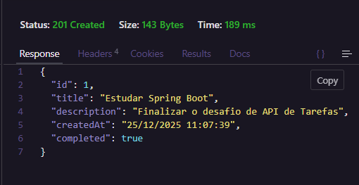
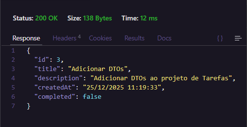
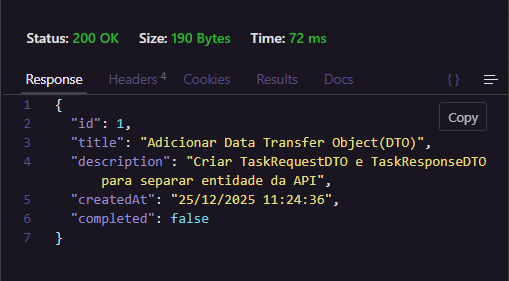
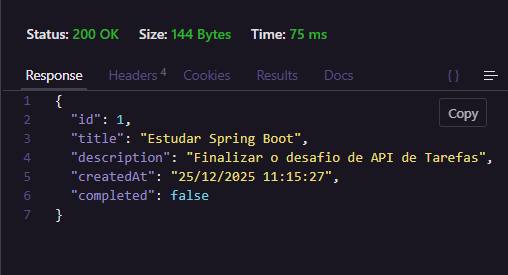
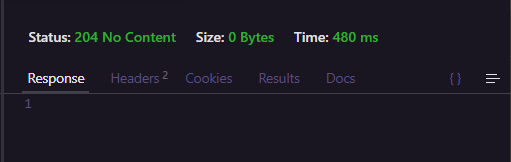

<h1 align="center">
  Task Management API
</h1>

Uma API RESTful para gerenciamento de tarefas desenvolvida como parte de um desafio prático de Spring Boot. 
O projeto foca em seguir as melhores práticas de desenvolvimento, como arquitetura em camadas e padrões REST.  

  <p align="center">
  <a href="https://skillicons.dev">
    
  </a>
</p>

  ---

## Tecnologias Utilizadas

- Java 21
- Spring Boot 4.0.1
- Spring Data JPA (Persistência de dados)
- H2 Database (Banco de dados em memória para testes rápidos)
- Lombok (Produtividade e código limpo)
- Jakarta Persistence (Mapeamento Objeto-Relacional)

---

## Arquitetura

O projeto segue a arquitetura de camadas para garantir a separação de responsabilidades:

- Controller: Exposição dos endpoints e tratamento de requisições HTTP.
- Service: Camada de regras de negócio e validações.
- Repository: Interface de comunicação com o banco de dados via JPA.
- Entity: Representação do modelo de dados.

---

## Endpoints da API

A API permite as seguintes operações:
| Método HTTP | Endpoint                | Descrição                                 |
|------------|-------------------------|-------------------------------------------|
| POST       | `/api/tasks`            | Cria uma nova tarefa                      |
| GET        | `/api/tasks`            | Lista todas as tarefas cadastradas        |
| GET        | `/api/tasks/{id}`        | Busca uma tarefa específica pelo ID       |
| PUT        | `/api/tasks/{id}`        | Atualiza todos os dados de uma tarefa     |
| PATCH      | `/api/tasks/{id}/status` | Atualiza o status de conclusão da tarefa  |
| DELETE     | `/api/tasks/{id}`        | Remove uma tarefa do sistema              |

Exemplo de JSON para Criação (POST):  
```json
{  
  "title": "Estudar Spring Boot",
  "description": "Finalizar o desafio e postar no GitHub",
  "completed": false
}
```

---

## Conceitos Aplicados

- **Arquitetura em Camadas:** Divisão entre Controller, Service e Repository.
- **Injeção de Dependência:** Uso de construtores para um código mais testável.
- **Padronização REST:** Uso correto de verbos HTTP e Status Codes (`201`, `204`, `404`).
- **JPA & Hibernate:** Mapeamento de entidades, IDs automáticos e uso de `@PrePersist`.
- **Regras de Negócio:** Validações de integridade na camada de Service.
- **JSON Handling:** Formatação personalizada de datas e tratamento de payloads.

---

## Como executar o projeto

1. Clone o repositório:
```
git clone https://github.com/paulo-czr/task.git

```
2. Execute a aplicação via IDE ou terminal:
```
./mvnw spring-boot:run
```
3. Acesse a API em: http://localhost:8080/api/tasks
4. Console do Banco H2: http://localhost:8080/h2-console

---

## Requisições HTTP
|  |  |  |
|:--:|:--:|:--:|
| POST | GET | PUT |

|  |  |   |
|:--:|:--:|:--:|
| PATCH | DELETE |   |


## Autor

Desenvolvido por **Paulo Cesar**  
📧 [PauloCesarCoder@gmail.com](mailto:PauloCesarCoder@gmail.com)  
🌐 [GitHub](https://github.com/paulo-czr)  
💼 [Meu LinkedIn](https://www.linkedin.com/in/paulo-czr)
